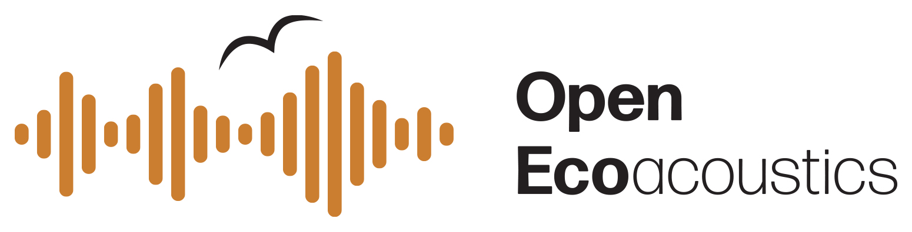

# The Acoustic Workbench

The Acoustic Workbench is an open source Ecoacoustics data management platform.

The workbench is a _white label_ appliance: multiple instance of the workbench can be run
independently, each with their own branding and data.

This repository is a meta repository that contains:

- links to the various components of the Acoustic Workbench
- user documentation
- developer documentation
- and various other resources

**THIS REPO IS A WORK IN PROGRESS**

## Known instances

There are currently two known instances of the Acoustic Workbench:

- [Ecosounds](https://ecosounds.org) is a public instance of the workbench that is run by the QUT Ecoacoustics Research Group
  - Private and public data hosted for any user.
  - No fixed experimental design or data collection strategy.
- [The Australian Acoustic Observatory](https://data.acousticobservatory.org) (the A2O) is run by the QUT Ecoacoustics Research Group
  - The A2O is a large scale experiment with a fixed experimental design. Read more [here](https://acousticobservatory.org).
  - All data is licensed under the Creative Commons License
  - No public contributions of audio are accepted

Are you running an instance? Edit this file and add your instance here.

All instances run the exact same workbench software. The only difference is the purpose, data, and branding.

## Components

There are two main components of the Acoustic Workbench:

### workbench-server

https://github.com/QutEcoacoustics/baw-server

A Ruby on Rails application that provides a RESTful API for managing Ecoacoustics data and metadata.

### workbench-client

https://github.com/QutEcoacoustics/workbench-client

An Angular application that provides a web interface for managing Ecoacoustics data and metadata.

### Supporting components

There are several other components that are important:

- [EMU](https://github.com/QutEcoacoustics/emu) is a collection of tools for extracting metadata and repairing faulty audio files
- [CRANE](https://github.com/QutEcoacoustics/crane) is a container that collects all analyses we use on the workbench

## Documentation

This repository contains documentation for the Acoustic Workbench. See the

- [User documentation](user_documentation/README.md)
- [System documentation](system_documentation/README.md)
- and our [Requirements](requirements/README.md)

## Acknowledgements

This work has been supported through several grants. 

The most recent of which is the ARDC Platforms project.
[Open Ecoacoustics](https://openecoacoustics.org/) currently sponsors development of the workbench thanks to the ARDC Platforms project.
See <https://doi.org/10.47486/PL050> for more details.

(TODO: add historical grants)